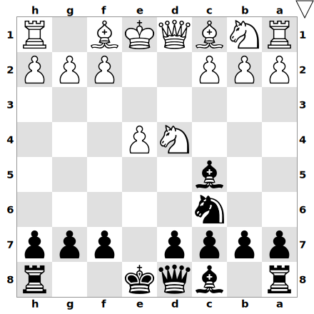
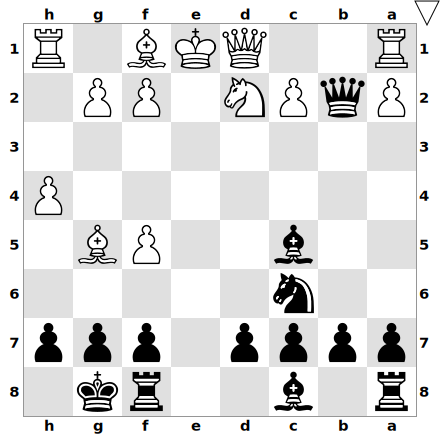
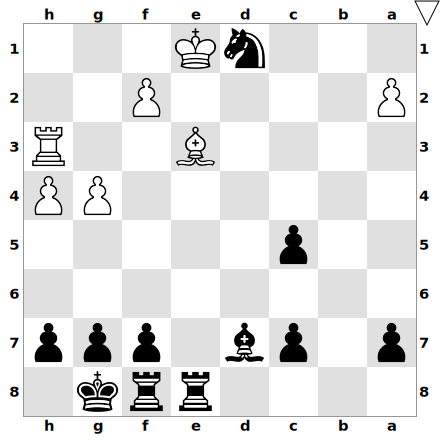
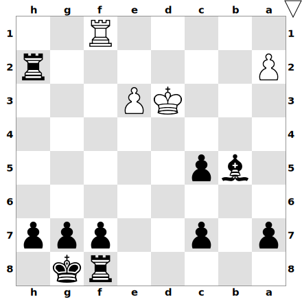

# Introduction
Well after I started taking chess lessons, I received an unexpected e-mail: I was selected to play in the Catalan chess league next Sunday. Being a Tuesday, I was at the office. And having started in a new company merely two weeks ago, I was not in shape. I had neglected chess training for most of that month. In all that mess, I forgot to uncheck my name from the available player's list for that game. 

Not only I had speedrun my training, but I was also playing with black. All my prep was around d4 openings with white so go figure how did I feel. I talked to my manager and kindly asked him if he would let me work from home for the rest of the week so I could save up the 1h20 commute. He agreed. Thus began my epic training montage, like in karate kid. My prep was centered on e4 openings and not by employing a swiss army knife like the King's Indian.

The day arrived. I woke up, took a shower, drank my coffee, ate something to avoid starvation, and headed to the metro. I was nervous, very nervous, almost shaking. I arrived there just to find out that the boards did not have guides. So I had to rely on myself for notation, great, another bump down the road. I looked for my board, sat down, put on my trusted earplugs and this was it, game on!

# Game analysis
So the game began on time. The first moves were your usual scotch opening. Fun fact, the Friday before this game, my trainer asked me what did I want to review. I suggested taking a look at the most common variations of the scotch. 

> 1. e4 e5 2. Nf3 Nc6 3. d4 exd4 4. Nxd4 Bc5 

So we arrive at this common position in the scotch:

My prep at this point was 5. Be3 or 5. Nxc6, but his move was 

> 5. Nf5 

So as a first-timer in classical over-the-board chess, I learned my first lesson: prep can't get you as far as you would always wish. Note that Nf5 is indeed a sideline but not one I had prepared. So I started to think. By applying the principles of chess, I came up with the next move:

> 5. .. Qf6

So what were my thoughts behind this? Well, two. First of all, it develops a piece that is what you are always told to do during the opening. But secondly, it pins the knight. Any move of this piece (except for Kxg7, which would hang the unit) hangs mate in 1 by Qxf2#. 

After analyzing this game with my coach, I found out that the mainline in that position was not Qf6. The best move was d5. I can't say that I saw it. I was a bit afraid of all the lines in which I had to sacrifice the g2 pawn and move the king.

So well, now it was time for my opponent to make a move, and oh boy did this next move puzzled me:

> 6. h4?

It appears to be a very questionable move. As if my opponent was trying to set up an attack on the kings' side. I didn't understand the meaning of it. But, despite being freakishly nervous, I started to think. Again, by carefully applying the principles of the game, I followed the logic:  the knight on f5 is his most active piece and, since we are in the opening, we have to develop. Oh, I see! He is not developing his pieces. Let's exploit that. How?

> 6. .. Nge7 

If he trades? I'm happy, I'll castle and we live to fight for another day. If he retreats? Happy as well. I'm making him lose a tempo. But none of those things happened. He played with a concept that Levy Rozman (GothamChess) usually talks about, danger levels. Wich means generating a higher threat to force your opponent to respond. And the move was:

> 7. Bg5??

Again, I did not expect that. The first thing I saw was the hanging b2 pawn. Rather than rushing, I stepped back. I thought: this could be a trap. He's trying to pull off an attack. Is he for real? Well, after some calculations, it turns out that he wasn't. My next move was obvious, followed by an almost forced response.

> Qxb2 8. Nd2 

Then, I stuck with my plan of punishing his underdevelopment and gently castled:

> Nxf5 9. exf5 O-O 

I'm not going to lie. It was at this point where I thought: Albert, we might win this game. See it for yourself:

Now his choices were few. He saw my queen infiltrating on the seventh. He tried to kick her out. An opportunity that I took to deliver a check and gobble two more other pawns. I was very proud of myself: despite being in a winning position, I was able to calculate all the possible responses to my check and each one of the consequences. I did not lose focus.

> 10. Rb1 Qe5+ 11. Qe2 Qxf5 12. g4 Qxc2 13. Rd1 

And we arrive at the following position:

With the white king surrounded by its pieces, the smell of the smothered mate was there. Also, you could see the alignment of the queen and the king on the e file. Very juicy for a pin. After several minutes of thinking, I decided to go with:

> 13. .. d6 

And the nerves and insecurities came crawling. My biggest flaw in chess is that I tend to step out of the gas pedal in winning positions. d6 seemed a slow move. The intentions were to exploit the fact that the queen was aligned with the king and to develop the light square bishop. From an objective point of view, it was a good move. But you know, my head was somewhere else. His response was as follows:

> 14. Rh3 Bd7 15. Qf3 

And at this point, my opponent went for a smoke. The obvious move was Rae8+, but again, being my first game I calculated, just in case an obscure line came up. Nevertheless, nothing worth taking into account emerged so I did play:

> 15. .. Rae8+ 

He was looking at the board through a window. He came back and slammed the board with:

> 16. Be2 Nd4 

I was proud of uncorking that fork. Out of options, my opponent tried to create some chaos at my queens' side without much result: 

> 17. Qxb7 Nxe2 

And yes, Rxe2 was mate in 7, I think. But I was having a bit of tunnel vision, trying to deliver mate with the knight. Finally, we simplified the board with:

> 18. Be3 Nc3 19. Qb3 Qxb3 20. Nxb3 Nxd1 21. Nxc5 dxc5 22. Rg3 

And now, a question for you, the reader: Why didn't he take the knight?

Well because, after Kxd1, comes Bxg4, forking the king and the rook. I did see this trick and, let me say it, I was filled with joy. The game ended in the following way:

> Nxe3 23. fxe3 Re4 24. Kd2 Rxg4 25. Rf3 Rxh4 26. Rf1 Rh2+ 27. Kd3 Bb5+ *

He conceded after the skewer landed on the board. The final position was the following:

# Takeaways
All in all, I'm delighted with the outcome. Despite my opponents' mistakes, I still had to think and try to exploit the positions as much as I possibly could. 

Looking back I did enjoy the experience but at the moment... I was extremely nervous. I can't stress it enough. But that is something that I will have to figure out. Years ago, I used to play MTG (Magic the Gathering), and yes, I was as nervous as I could be during my firsts Friday Night Magic tournaments. But after some games, things became familiar and more enjoyable. I think that what I need is to expose myself to more OTB games and learn by experience how to calm down.

# Catalan Federation of Chess ELO
Since we are not playing in the first league, I'm only awarded Catalan ELO points. Your starting score is 1700. Since my opponent was 1649, I gained 17 ELO points. You can check out my progress [here](https://escacs.cat/index.php/component/fce?op=13&idJugador=397264&nom=).